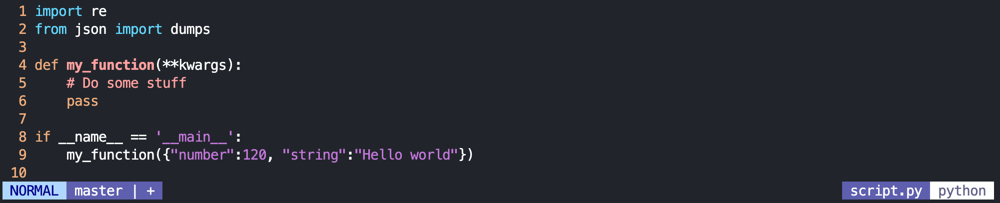
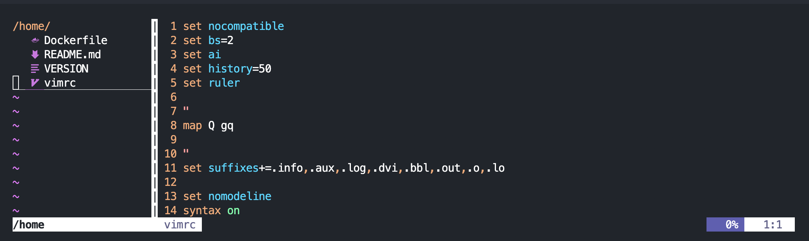
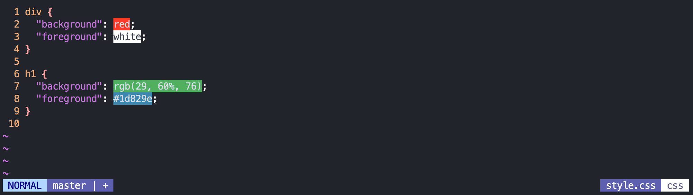

# VIM in Docker

 My personal vim customization, running in a lightweight docker container
 
 ```
 docker pull ghcr.io/antoniopantaleo/vim:latest
 ```

## Features

The image was built on top of `alpine` and uses plugins installed via [Vim-Plug](https://github.com/junegunn/vim-plug)

### [Syntastic](https://github.com/scrooloose/syntastic)



### [Nerdtree](https://github.com/scrooloose/nerdtree)



### [Lightline](https://github.com/itchyny/lightline.vim)


### [CSS Colors](https://github.com/ap/vim-css-color)



## How to use it

Copy or (better) make a symbolic link of `vim` script inside `/usr/local/bin`

```
$ cp vim /usr/local/bin
```

```
$ ln -s /my/absolute/path/vim /usr/local/bin
```
> Absolute path may be necessary if you have vim already globally installed
